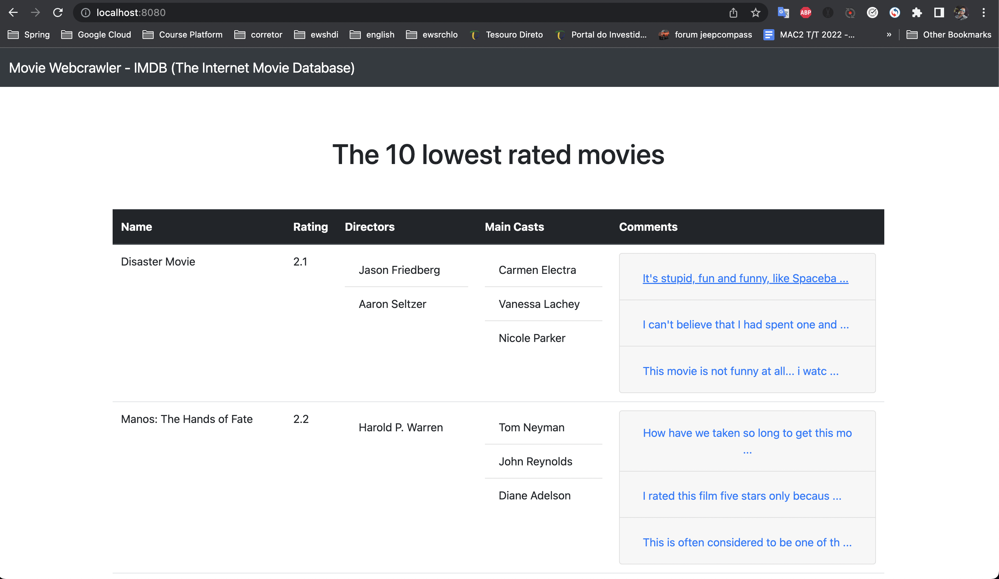
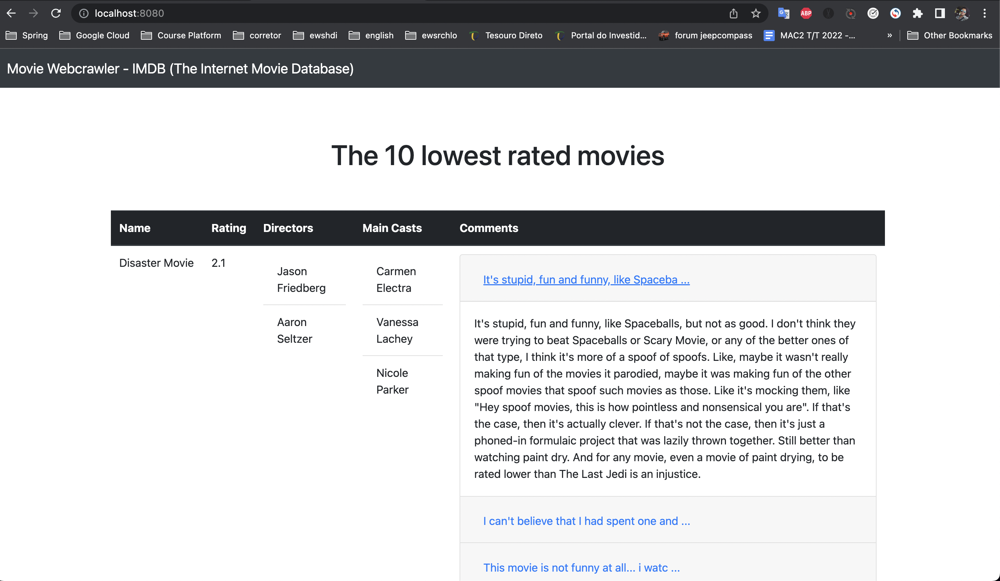

# Webcrawler

Designed to get data from IMDB's bottom chart, using JSoup using parallel processing. It uses the rank page to get the 10 worst rating movies, then their respective pages to get more details, then lastly goes to the reviews page and gets 3 medium rating comments.

### Technologies used:

- Java 17
- Spring Boot
- Spring Cache
- Lombok
- Jsoup
- Thymeleaf
- Bootstrap

### How this applications works

You can get the information about the 10 worst movies in two ways:

- Firstly when the application is started, the information is printed on the console through the following class:

```
@Slf4j
@Component
@RequiredArgsConstructor
public class MovieCommandLineRunner implements CommandLineRunner {

    private final MovieService movieService;

    @Override
    public void run(String... args) throws Exception {
        List<Movie> topWorstMovies = this.movieService.getMovies();

        log.info(topWorstMovies.toString());
    }

}
```

- On the second place, you can see the result about the movies on the web page:





### How the cache works

As you can see, when the application is started printing the information on the console, at this moment we use the class MovieService to keep in cache, being reused when the user access the browser.

```
@Service
@RequiredArgsConstructor
public class MovieService {

    private final MovieWebCrawler movieWebCrawler;

    @Cacheable(value = "MovieWebcrawlerApi",
            key = "'webcrawler'",
            cacheManager = "cacheManager")
    @SneakyThrows
    public List<Movie> getMovies() {
        return this.movieWebCrawler.getTopWorstMovies(10);
    }

}
```


### Running the application

- To run, use the following command: 

```
mvn clean compile exec:java -Dexec.mainClass="br.com.webcrawler.MovieWebcrawlerApplication"
```

- The application will log the 10 worst movies, and you can access a Thymeleaf page on the following link [here](http://localhost:8080/#)